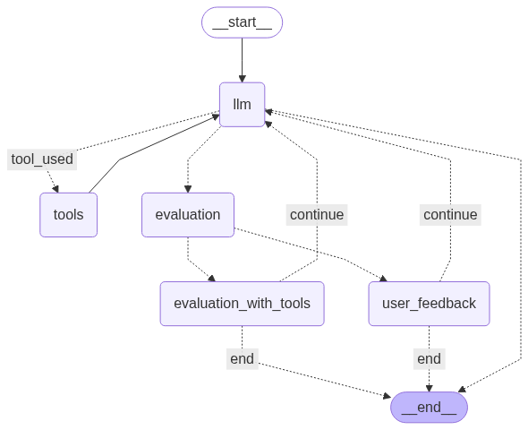

# Multi-Model Agentic RAG using LangGraph

AI Agentic System using LangGraph, LangChain, and LangSmith with integrated tool usage, dynamic evaluation, and retry loop based on feedback

A fully modular and intelligent agent built with **LangGraph**, **LangChain**, and **LangSmith**. 

## Features

- 🔁 Retry logic
- 🔎 Tool selection & routing
- 🧪 Evaluator feedback loop
- 🧰 Dynamic tool execution (Python, Calculator, Web Search, etc.)
- 💬 User clarification step
- 🧠 LLM decision engine
- 📊 LangSmith observability
- 🧾 Persistent memory

## 🗺️ Architecture



## 🚀 Features

- 🧠 **LLM as controller** — routes between tool use, evaluation, and direct reply.
- 🧪 **Evaluation-based retry** — when responses are inaccurate, the evaluator triggers a reattempt.
- ⚙️ **Tool use** — including:
  - Calculator
  - Code Execution
  - Web Search
  - File Saving
- 📝 **User feedback loop** — simulate user agreement or disagreement to refine response quality.
- 🧠 **Memory integration** — persists across sessions with LangGraph memory saver.
- 🧪 **LangSmith tracing** — full observability for each decision and step.

## 🧰 Tools Used

- `LangGraph`
- `LangChain`
- `OpenAI Function Calling`
- `LangSmith`
- `Chroma` (for RAG extension)
- `Python REPL`
- `Web Search`
- `File Save`

```bash
git clone https://github.com/anandreddy05/multi_model-_agentic_rag.git
```

```bash
cd Multi_Model_Agentic_RAG
pip install -r requirements.txt
python main.py
```
